# NELFIX

## Description

Program ini adalah hasil dari pengerjaan tahap 3 dari Seleksi Asisten LabPro 2024. Program ini merupakan program yang menyelesaikan Spesifikasi sesuai [yang diberikan](https://docs.google.com/document/d/1v72fEU8ofI_-Dwgp8M-B5ZoE7X4XAFKik7rZX-6Pla8/edit?usp=sharing). Program ini dibuat menggunakan Framework NestJS dan menggunakan bahasa pemrograman utama TypeScript.

## Tech Stack

- [NestJS](https://nestjs.com/)
- [Handlebars](https://handlebarsjs.com/)
- [Prisma](https://www.prisma.io/)
- [PostgreSQL](https://www.postgresql.org/)
- [CloudFlare](https://www.cloudflare.com/)
- [TailwindCSS](https://tailwindcss.com/)

## Features

### F01 - Frontend

- [x] Register Page
- [x] Login Page
- [x] Browse Page
- [x] Film Details Page
- [x] My List Page

### F02 - Backend

- [x] Register
- [x] Login
- [x] Browse Film
- [x] Buy Film
- [x] Bought Film

### F03 - REST API

- [x] CRUD Film (Admin)
- [x] Auth Admin (using JWT)
- [x] RUD User (Admin)

## How to Use

### Prerequisites

- [Node.js](https://nodejs.org/en/)
- [yarn](https://yarnpkg.com/)
- [Docker](https://www.docker.com/)

### Installation

#### Classic Way

1. Clone repository ini

    ```bash
    git clone https://github.com/TazakiN/seleksi-3-labpro.git
    ```

2. Install dependenciies yang diperlukan

   ```bash
   yarn install
   ```

3. Buat file `.env` di root directory dari project ini dengan menyalin file `.env.example`. Isi variabel-variabel yang diperlukan.
    - Untuk mendapatkan variabel untuk R2 CloudFlare, Anda dapat mengunjungi [R2 CloudFlare](https://developers.cloudflare.com/r2/) untuk mendapatkan variabel-variabel yang diperlukan.
    - Untuk mendapatkan variabel untuk DATABASE_URL dan DIRECT_URL, Anda dapat mengunjungi [Koyeb](https://www.koyeb.com/) atau [Supabase](https://supabase.com/) untuk mendapatkan variabel-variabel yang diperlukan.
    - Untuk PORT, Anda dapat menggunakan 3000 atau port lain yang tidak digunakan. README ini mengasumsikan PORT bernilai 3000.
    - Untuk BASE_URL, Anda dapat menggunakan `http://localhost:3000` atau URL lain yang ingin Anda gunakan
    - Untuk JWT_SECRET dan ADMIN_ID, Anda dapat menggunakan string random yang diinginkan
    - Untuk REDIS_URL, Anda dapat menggunakan URL Redis yang ingin Anda gunakan. Jika ingin menggunakan Docker, atur `docker-compose.yml` untuk menggunakan Redis.

4. Hasilkan Prisma Client dengan menjalankan perintah berikut dari file `schema.prisma` dengan menjalankan perintah berikut

    ```bash
    yarn prisma generate
    ```

5. Jalankan migrasi database dengan menjalankan perintah berikut

    ```bash
    yarn prisma migrate deploy
    ```

6. Jalankan program

   ```bash
    yarn start
    ```

7. Buka browser dan buka `http://localhost:3000`

#### Docker Way

1. Clone repository ini

    ```bash
    git clone https://github.com/TazakiN/seleksi-3-labpro.git
    ```

2. Buat file `.env` di root directory dari project ini dengan menyalin file `.env.example`. Isi variabel-variabel yang diperlukan.

3. Build Docker image

    ```bash
    docker build -t nel-fix .
    ```

4. Hasilkan Prisma Client dengan menjalankan perintah berikut dari file `schema.prisma` dengan menjalankan perintah berikut

    ```bash
    yarn prisma generate
    ```

5. Jalankan migrasi database dengan menjalankan perintah berikut

    ```bash
    yarn prisma migrate deploy
    ```

6. Run Docker image

    ```bash
    docker run -p 3000:3000 nel-fix
    ```

7. Buka browser dan buka `http://localhost:3000`

#### Deployed Version

Anda dapat mengakses versi deployed dari program ini di [coming-fernande-seleksilapro-a16662b2.koyeb.app](coming-fernande-seleksilapro-a16662b2.koyeb.app)

### Seed Data

Anda dapat menggunakan aplikasi secara langsung. Namun jika ingin menambahkan beberapa data yang telah dibuat terlebih sebelumnya, anda dapat menggunakan seed data yang telah disediakan dengan menjalankan perintah berikut

```bash
yarn seed
```

## Design Pattern

1. **Singleton Pattern**
    Singleton Pattern digunakan untuk membuat instance dari class yang hanya bisa dibuat satu kali selama class tersebut hidup. Singleton Pattern digunakan pada class `PrismaService` untuk membuat instance dari Prisma Client yang hanya bisa dibuat satu kali dan hanya bertanggung jawab untuk segala operasi yang berkaitan dengan Prisma Client.

2. **Strategy Pattern**
    Strategy Pattern digunakan untuk membuat class yang memiliki method yang sama namun memiliki implementasi yang berbeda. Strategy Pattern digunakan pada class `Admin.Guard` dan `User.Guard` untuk membuat class yang memiliki method `canActivate` yang sama namun memiliki implementasi yang berbeda untuk validasi token JWT.

3. **Decorator Pattern**
    Decorator Pattern digunakan untuk menambahkan fitur tambahan pada class atau method tanpa mengubah struktur dari class atau method tersebut. Decorator Pattern digunakan pada class `Jwt.Guard` untuk menambahkan fitur validasi token JWT pada method yang menggunakan decorator `@UseGuards(JwtGuard)`.

## Endpoints

### Auth

| Method   | URL                                      | Description                              |
| -------- | ---------------------------------------- | ---------------------------------------- |
| `GET`    | `/register`                             | Mengembalikan halaman register.           |
| `POST`   | `/register`                             | Mendaftarkan user baru.                  |
| `GET`    | `/login`                                | Mengembalikan halaman login.             |
| `POST`   | `/login`                                | Melakukan login.                         |

### Browse

| Method   | URL                                      | Description                              |
| -------- | ---------------------------------------- | ---------------------------------------- |
| `GET`    | `/browse`                               | Mengembalikan halaman browse film.       |
| `GET`    | `/browse/:id`                           | Mengembalikan halaman film-film yang dimiliki oleh user dengan id tertentu.       |

### Bucket

| Method   | URL                                      | Description                              |
| -------- | ---------------------------------------- | ---------------------------------------- |
| `GET`    | `/bucket/cover-images/:key` | Mengembalikan cover image dari film dengan key tertentu.|
| `GET`    | `/bucket/videos/:key`                   | Mengembalikan video dari film dengan key tertentu.|

### Users

| Method   | URL                                      | Description                              |
| -------- | ---------------------------------------- | ---------------------------------------- |
| `GET`    | `/users`                                | Mengembalikan semua user dengan query tertentu|
| `GET`    | `/users/:id`                            | Mengembalikan data user dengan id tertentu.|
| `PATCH`    | `/users/:id`                            | Mengubah data user dengan id tertentu.   |
| `DELETE`    | `/users/:id`                            | Menghapus data user dengan id tertentu.  |
| `GET`    | `/users/:id/detail`                    | Mengembalikan halaman detail user dengan id tertentu.|
| `POST` | `/users/:id/balance` | Menambahkan saldo user dengan id tertentu. |

### Films

| Method   | URL                                      | Description                              |
| -------- | ---------------------------------------- | ---------------------------------------- |
| `POST`    | `/films`                                | Menambahkan film baru.                   |
| `GET`    | `/films`                                | Mengembalikan semua film.                |
| `GET`    | `/films/:id`                            | Mengembalikan data film dengan id tertentu.|
| `PUT`    | `/films/:id`                            | Mengubah data film dengan id tertentu.   |
| `DELETE`    | `/films/:id`                            | Menghapus data film dengan id tertentu.  |
| `GET`    | `/films/details/:id`                    | Mengembalikan halaman detail film dengan id tertentu.|
| `GET`    | `/films/watch/:id`                      | Mengembalikan halaman menonton film dengan id tertentu.|
| `POST`    | `/films/buy/:idUser/:idFilm`            | idUser Membeli sebuah film  tertentu.         |

## BONUS

### B02 - Deployment

Program ini telah di-deploy menggunakan [Koyeb](https://www.koyeb.com/). Anda dapat mengakses program ini di [coming-fernande-seleksilapro-a16662b2.koyeb.app](coming-fernande-seleksilapro-a16662b2.koyeb.app). Berikut adalah gambar dari program ini yang di-deploy di Koyeb.

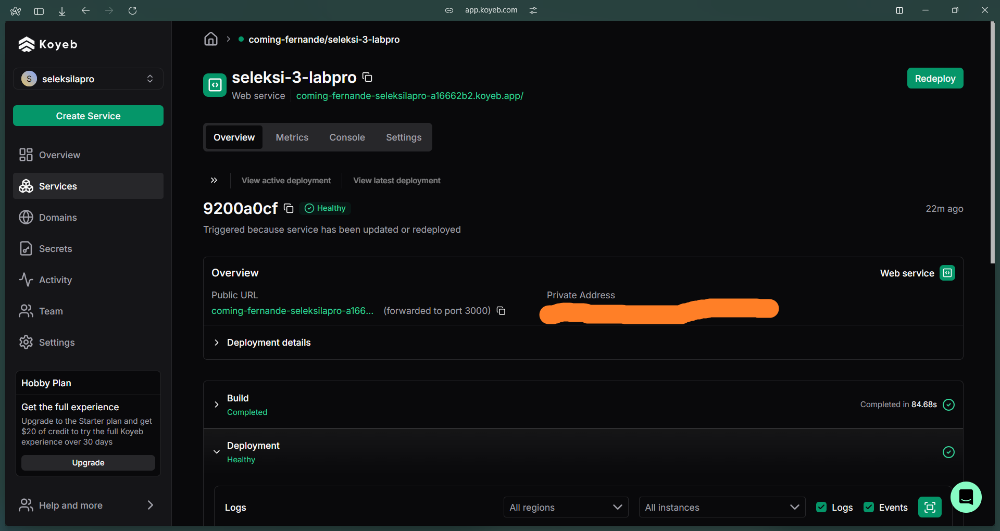

Database yang digunakan adalah PostgreSQL yang juga di-deploy menggunakan [Koyeb](https://www.koyeb.com/)

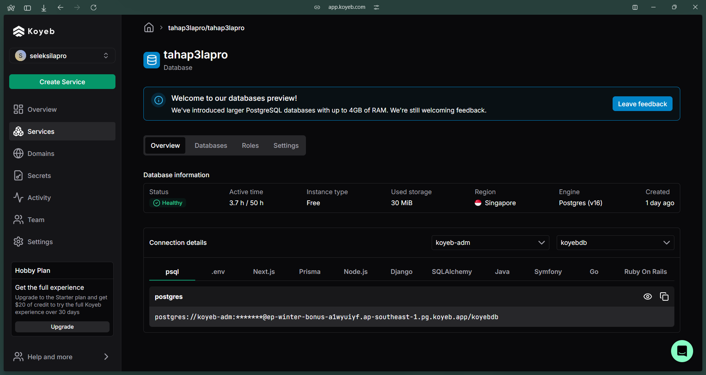

### B04 - Caching

Program ini menggunakan caching untuk beberapa endpoint. Program ini menggunakan [Redis](https://redis.io/) sebagai caching. Implementasi Cache dapat terlihat pada setiap class Controller yang menggunakan decorator `@UseInterceptors(CacheInterceptor)`.
Dapat dilihat pada class `FilmsController` dan `UsersController` yang menggunakan caching untuk beberapa endpoint beserta manipulasi data cache ketika terjadi perubahan data.

Storing data pada cache dilakukan dengan menggunakan key yang unik untuk setiap data yang disimpan. Key yang digunakan adalah `cacheKey` yang merupakan URL dari endpoint yang diakses. Key ini digunakan untuk menyimpan data pada cache dan mengambil data dari cache.

Dengan menggunakan RedisLab, program ini dapat menggunakan Redis sebagai tempat penyimpanan cache. Hal ini memungkinkan program yang dideploy untuk memiliki penyimpanan cache yang lebih cepat dan efisien.

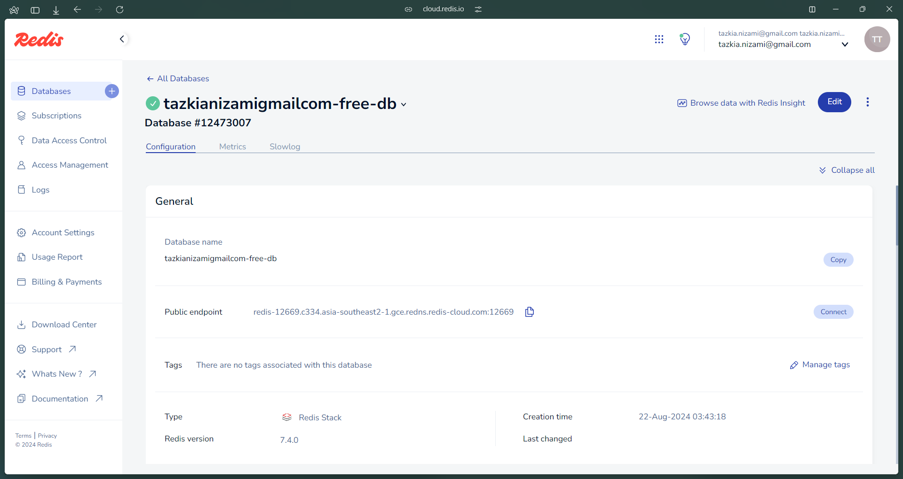

### B05 - Lighthouse Score

Lighthouse adalah sebuah tool yang digunakan untuk mengukur performa, aksesibilitas, SEO, dan best practices dari sebuah website. Program ini telah diuji menggunakan Lighthouse dan mendapatkan skor sebagai berikut:

- Login Page
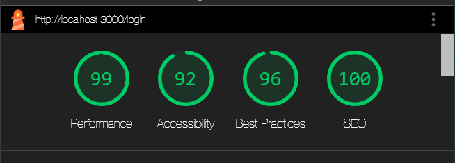

- Register Page
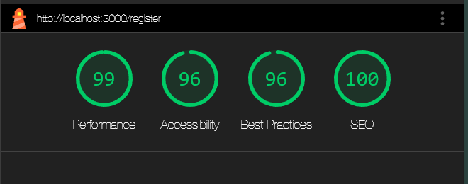

- Browse Page
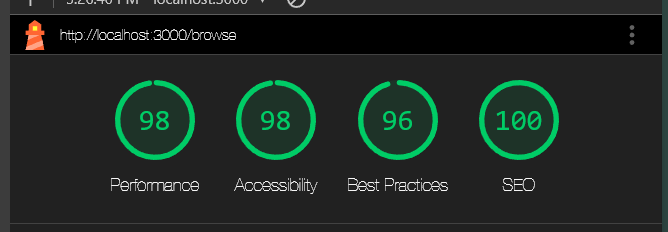

- Film Details Page
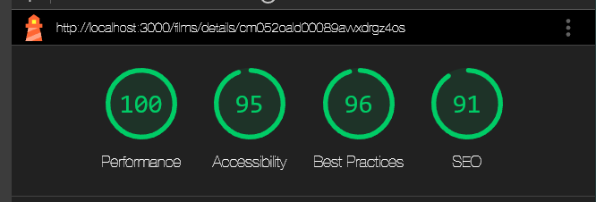

- My List Page
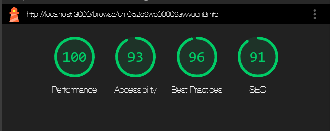

- Account Details Page
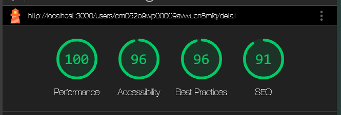

- Watch Page
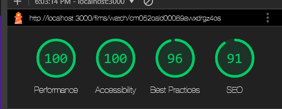

### B06 - Responsive Layout

Program ini menggunakan [TailwindCSS](https://tailwindcss.com/) untuk membantu dalam membuat layout yang responsive. Program ini dapat diakses di berbagai perangkat dengan ukuran layar yang berbeda, seperti desktop, tablet, dan mobile.

### B07 - Dokumentasi API

Dokumentasi API dari program ini dapat diakses di [coming-fernande-seleksilapro-a16662b2.koyeb.app/api-docs](coming-fernande-seleksilapro-a16662b2.koyeb.app/api-docs) yang dibuat dengan menggunakan [Swagger](https://swagger.io/). Dokumentasi API ini berisi informasi mengenai endpoint-endpoint yang ada pada program ini dan cara penggunaannya. Dokumentasi API ini juga dapat diakses ketika program ini dijalankan secara lokal (seperti `http://localhost:3000/api-docs`).

Berikut adalah contoh dokumentasi API yang dapat dilihat pada program ini:

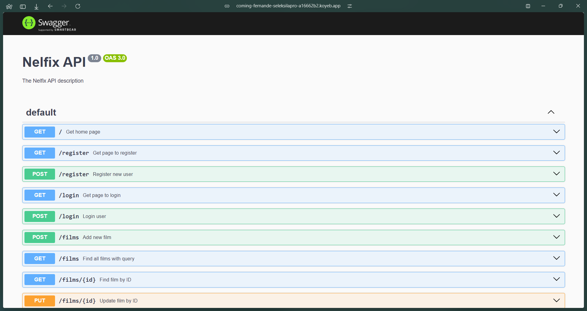

### B08 - SOLID Principle

Program ini menggunakan SOLID Principle untuk membangun program yang lebih baik dan mudah untuk di-maintain. Berikut adalah contoh implementasi SOLID Principle pada program ini:

- **Single Responsibility Principle (SRP)**

    Setiap class pada program ini memiliki tanggung jawab yang spesifik dan hanya melakukan satu hal. Contoh implementasi SRP pada program ini adalah class `FilmService` yang bertanggung jawab untuk mengakses data dari database dan melakukan operasi CRUD pada tabel `film` dan class `UsersService` yang bertanggung jawab untuk mengakses data dari database dan melakukan operasi CRUD pada tabel `users`.

- **Open/Closed Principle (OCP)**
    Program ini menggunakan decorator untuk menambahkan fitur tambahan pada class atau method tanpa mengubah struktur dari class atau method tersebut. Contoh implementasi OCP pada program ini adalah class `Jwt.Guard` yang menggunakan decorator `@UseGuards(JwtGuard)` untuk menambahkan fitur validasi token JWT pada method yang menggunakan decorator tersebut.

    Contoh implementasi OCP pada program ini adalah sebagai berikut:

    ```typescript

  @UseGuards(JwtGuard)
  @Get(':id')
  @ApiOperation({ summary: 'Get user by ID' })
  getUser(@Param() idUserDTO: idUserDTO) {
    return this.usersService.getUser(idUserDTO.id);
  }

  @UseGuards(JwtGuard)
  @Post(':id/balance')
  @ApiOperation({ summary: 'Add balance to user' })
  addBalance(@Body() incDTO: incBalanceDTO, @Param() idUserDTO: idUserDTO) {
    this.cacheManager.del('/users/' + idUserDTO.id + '/detail');
    return this.usersService.addBalance(idUserDTO.id, incDTO.increment);
  }
    ```

- **Liskov Substitution Principle (LSP)**
    Program ini menggunakan class yang dapat digunakan sebagai pengganti class induknya. Contoh implementasi LSP pada program ini adalah class `FilmService` yang dapat digunakan sebagai pengganti class `PrismaService` yang merupakan class induknya.

- **Interface Segregation Principle (ISP)**
    Program ini menggunakan interface yang memiliki tanggung jawab yang spesifik dan hanya memiliki method yang diperlukan. Contoh implementasi ISP pada program ini adalah interface `Film` yang memiliki method yang diperlukan untuk class `FilmService`.

- **Dependency Inversion Principle (DIP)**
    Program ini menggunakan dependency injection untuk mengurangi ketergantungan antar class. Contoh implementasi DIP pada program ini adalah class `FilmService` dan `UsersService` yang menggunakan dependency injection untuk mengakses Prisma Client yang terdapat pada class `PrismaService`.

### B11 - Ember

Program ini menggunakan Bucket untuk menyimpan cover image dan video dari film-film yang ada. Bucket yang digunakan adalah [R2 CloudFlare](https://developers.cloudflare.com/r2/).

Program yang di-deploy menggunakan [Koyeb](https://www.koyeb.com/) menggunakan Bucket dari R2 CloudFlare untuk menyimpan cover image dan video dari film-film yang ada. Berikut adalah gambar dari Bucket yang digunakan:

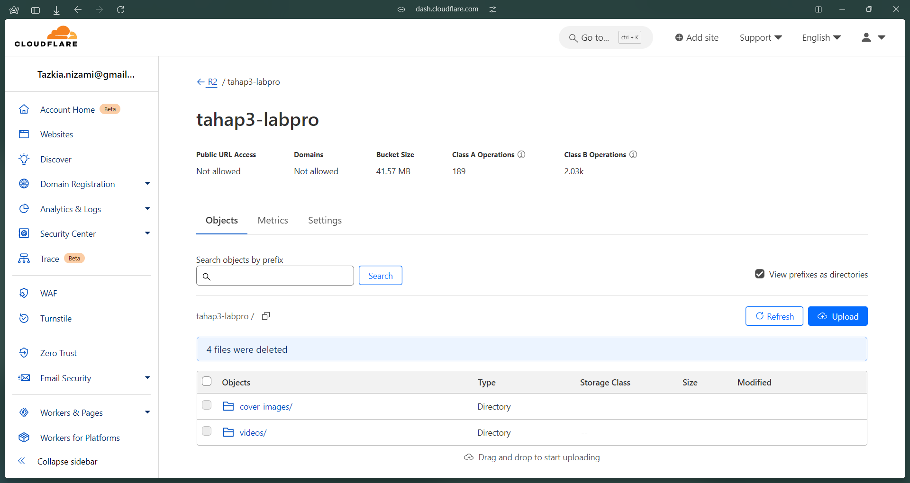

## Author

- 13522032 - [Tazkia Nizami](https://github.com/TazakiN)
